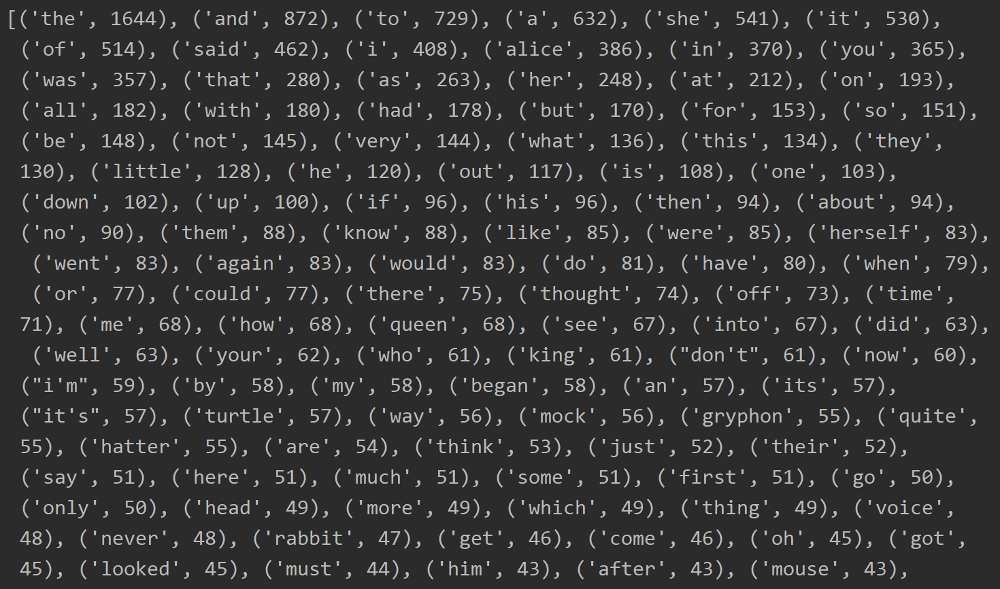

# word-counter
A hash map-based concordance that counts the number of each word in a text file.



## Installation & Usage

Run the word_count.py script inside your favorite IDE, and the output will display a list of tuples, each tuple being a word-frequency pair (e.g. ('the', 1644)). To adjust the number of words returned in the output, change the second argument passed into top_words():

```python
print(top_words("alice.txt", 10))
```

## Authors and acknowledgment

- Timothy Yoon
- The project idea and starter code is courtesy of Oregon State University's Spring 2020 Data Structures (CS 261) course.
